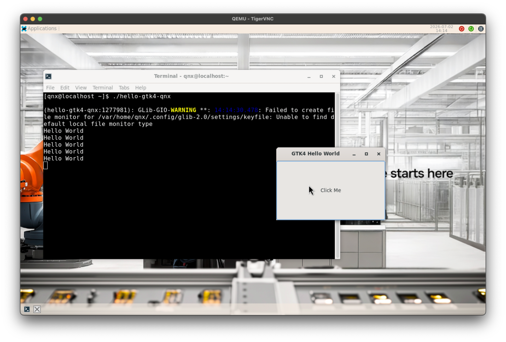
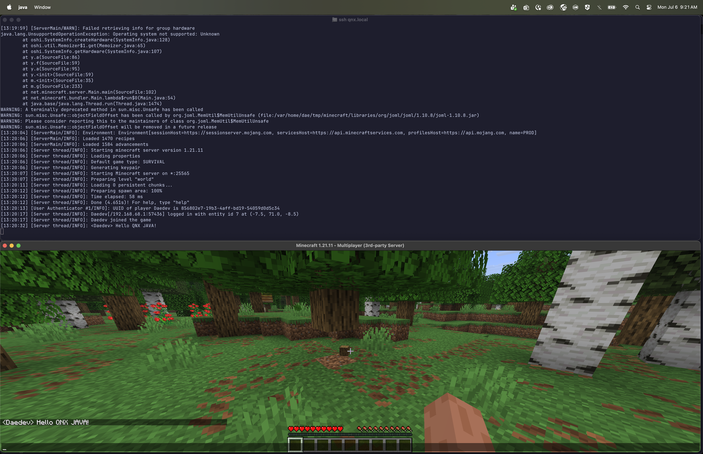

id: apk-based-cross-compile 
title: Cross-Compile for QNX Using Open Source Packages
summary: Simplify QNX cross-compilation with prebuilt open source packages. Use `apk-tools` to manage deps, wire to `qcc`, and build C & GTK4 applications
categories: qnx, porting
tags: intermediate
difficulty: 2
status: published
authors: Aaron Bassett
feedback_link: https://github.com/qnx/codelabs/issues

# Cross-Compile for QNX Using Open Source Packages

## Introduction
Duration: 2:00

The self-hosted environment is a powerful tool, but in cases where you have an existing project that needs to use qcc, how do you utilizes the catalog of open source ports?

**What you will learn:**

* How to setup a apk-tools managed sysroot
* How to setup qcc to use the apk-tools managed sysroot
* Building a simple C program
* Building a GTK 4 application
* How to cross compile existing oss projects 


**Prerequisite**

* QNX Software Center installed and SDP 8.0.x version matching your target
* Sourcing the SDP version

---

## Setting up apk-tools
Duration: 5:00

apk ... no not android apk!!! apk-tools from Alpine linux is a lightweight but powerful package manager designed for systems that are optimized at scale. We have ported apk-tools to QNX. In order to install the packages from the QNXe repository, we need to have apk-tools built and installed on our host system. For this exercise we are going to assume a linux system.

### Build dependencies

Before we can begin we can compile apk-tools we first need to acquire system dependencies.

#### Debian
```sh
sudo apt install build-essential meson ninja-build pkg-config git libssl-dev zlib1g-dev libzstd-dev lua5.3
```

#### Arch
```sh
sudo pacman -S base-devel meson ninja git openssl zlib zstd lua53
```

#### Alpine
```sh
doas apk add build-base meson ninja pkgconf git openssl-dev zlib-dev zstd-dev lua5.3
```

### Compiling a static apk-tools binary

In order to make our life just a bit easier we are going to setup apk as a static binary. That way we don't need to set LD library paths.

```sh
# 3.0.6 is the latest version we are using at the time of writing. Check what version of apk-tools we are using for your system
git clone https://gitlab.alpinelinux.org/alpine/apk-tools.git --branch v3.0.6
```

```sh
meson setup -Dc_link_args="-static" -Dprefer_static=true -Ddefault_library=static build
ninja -C build src/apk
./build/src/apk --help

mkdir -p ~/.local/bin
cp ./build/src/apk ~/.local/bin

# If you want to have apk available all the time add this to your ~/.bashrc or ~/.zshrc
export PATH=$PATH:~/.local/bin
```

---

## Setting up abuild
Duration: 3:00

abuild is alpine's build system for packaging using APKBUILD files, we will need to setup abuild on our host in order to build apk wrapped qpkgs (QNX Software Center packages) which allows apk-tools to integrate QNX provided software.

### Build dependencies

Before we can begin we can compile abuild we first need to acquire system dependencies.

#### Debian
```sh
sudo apt install build-essential git make pkg-config libssl-dev scdoc fakeroot pax bsdextrautils curl bc pax-utils
```

#### Arch
sudo pacman -S base-devel git openssl scdoc fakeroot patch curl bc pax-utils
```

#### Alpine
```sh
doas apk add build-base git make openssl-dev scdoc fakeroot patch curl bc pax-utils
```

### Building abuild

```sh
# 3.15.0 is the latest version we using at the time of writing. Check what version of abuild we are using for your system
git clone https://github.com/qnx-ports/abuild --branch qnx-3.15.0
```

We are going to install this in your `.local` directory to not pollute your system

```sh
make install prefix="$HOME/.local" sysconfdir="$HOME/.local/etc"
```

### Setting up signing key

Part of apk-tools and abuild is its packaging signing system that validates that a trusted authority has made these packages. For this you are going create your own signing keys for these packages and set yourself as a trusted authority.

```sh
abuild-keygen -a
```

## Building QNX wrapped apks
Duration: 5:00

Now that we have our tooling setup we can now build our qnx wrapped apks.

### Dependencies

But first we need some runtime dependencies 

#### Debian

```sh
sudo apt install netcat-openbsd python3
```

#### Arch
```sh
sudo pacman -S openbsd-netcat
```

#### Alpine

There is nothing needed because busybox provides netcat.

### Running build-qsc-apk

For this step we will need 2 repositories.
1. qnx-ports/qsc-apk: this is where all the APKBUILD definitions are stored and branched based on the sdp version
2. qnx-packaging/build-qsc-apk: a helper script that will download the qpkgs from swcenter and build apks

```sh
git clone https://github.com/qnx-ports/qsc-apk --branch 804
git clone https://github.com/qnx-packaging/build-qsc-apk.git
```

we need to know which architecture we want to package for - so pick what you want to build for (or if you build both, they get their own folders)

```sh
build-qsc-apk -o  ~/.cache/qsc-apk/8.0.4/ --arch <x86_64|aarch64> --swc-cli-path ~/qnx/qnxsoftwarecenter/qnxsoftwarecenter_clt ./qsc-apk/qnx-core
build-qsc-apk -o  ~/.cache/qsc-apk/8.0.4/ --arch <x86_64|aarch64> --swc-cli-path ~/qnx/qnxsoftwarecenter/qnxsoftwarecenter_clt ./qsc-apk/qnx-extra
```

---

## Setting up the apk-tools sysroot

We are now ready to setup our sysroot. a sysroot is a qnx system inside a folder, this allows your compiler/build system to discover libraries, headers and other things like pkg-conf


#### Setting up the folder


```sh
mkdir -p ./qnx-apk-sysroot
cd ./qnx-apk-sysroot

# We are a user merged system so we need to setup symlinks
mkdir -p usr/lib usr/bin
ln -s usr/lib usr/bin .
# Pick one arch here based on your target this is comparability for qcc
ln -s . <x86_64|aarch64le>
```

#### Initializing apk-tools

Now that we have a folder structure we can ask apk to initialize the root for package management

```sh
apk --root . add --initdb --usermode
```

In order to install packages we need to tell apk what keys are trusted. We will setup our qnx signing key as well as the one we made back when we built abuild

```sh
mkdir -p etc/apk/keys
curl -L -o etc/apk/keys/qnxosd.rsa.pub https://repo.oss.qnx.com/keys/qnxosd.rsa.pub

cp ~/.abuild/*.pub etc/apk/keys/
```

Now we need to tell apk what repositories we want to pull packages from. Here we are doing an 8.0.4 system so we grab those repos plus the qsc-apk packages we made before

```sh
cat << EOF > etc/apk/repositories
https://repo.oss.qnx.com/8.0.3/core
https://repo.oss.qnx.com/8.0.3/extra
https://repo.oss.qnx.com/8.0.4/core
https://repo.oss.qnx.com/8.0.4/qnx-extra
$HOME/.cache/qsc-apk/8.0.4/qnx-core
$HOME/.cache/qsc-apk/8.0.4/qnx-extra
EOF
```

Lets tell apk to update its database with the new keys and repositories

```
apk --root . update 
```

Now that our sysroot is all setup lets copy the full path
```sh
# This could be just `pwd` ... but i like paths relative to home
echo "${PWD/#$HOME/\~}"
```

---

## Hello world from C

After all that setup lets make sure we have everything working correctly. What's better than a good old hello world!!!?

### Dependencies

Now we are going to use apk to get qnx dependencies that we need for C, this includes things like libc, gcc runtime libraries, and system headers

```sh
apk --root <path-to-qnx-apk-sysroot> add qnx-microkernel qnx-microkernel-dev qnx-gcc-libs qnx-gcc
```

### The code

We are going to make a directory called `hello-world-apk` with a `main.c` and a `Makefile` the result will look like this

```
hello-world-apk/
|-- main.c
|-- Makefile
```

Just a very simple hello-world which should look familiar to everyone

```c
// main.c
#include <stdio.h>
#include <stdlib.h>

int main(int argc, char *argv[]) {
    printf("Hello, World from Linux on QNX!\n");
    return EXIT_SUCCESS;
}

```

While I could just give you a single command line to run and get the same result, having a makefile makes it easier to understand whats going on

```make
# Makefile
# We are using qcc
CC = qcc
# we need the path to our sysroot. if you have been following along exactly this should work
# if not just `make SYSROOT=<path-to-qnx-apk-sysroot>`
SYSROOT ?= ../qnx-apk-sysroot

# This is where the magic happens
# 1. We add CFLAGS in-order for the compiler to recognize our sysroot for headers
CFLAGS += -I$(SYSROOT)/usr/include
# 2. We add LDFLAGS in-order to tell the linker in where to find shared libraries
LDFLAGS += -L$(SYSROOT)/usr/lib
# 3. We are the qnx target now
export QNX_TARGET="$(SYSROOT)"

# the rest of this make file is nothing special its just a standard makefile.
TARGET = hello-qnx
SRCS = main.c

all: $(TARGET)

$(TARGET): $(SRCS)
	$(CC) $(CFLAGS) -o $(TARGET) $(SRCS) $(LDFLAGS)

clean:
	rm -f $(TARGET)
```

### Building hello-world

Okay now.. lets ... make it ... with make ... say that 5 times fast

```
make
```

so now it should've worked :tada: ... but let's validate my claims first with handy dandy `file`

```sh
$ file hello-qnx
hello-qnx: ELF 64-bit LSB pie executable, x86-64, version 1 (SYSV), dynamically linked, interpreter /usr/lib/ldqnx-64.so.2, BuildID[md5/uuid]=34294113c5f608180bcc564d5a80ac01, with debug_info, not stripped
```

you should get something like this. What we really care about is the interpreter part. We should see `/usr/lib/ldqnx-64.so.2` ... if so we are good to go. Copy this onto your target and give it a run

```sh
scp hello-qnx qnxuser@<ip/hostname>:~/
```

and lets give it a run

```sh
ssh qnxuser@<ip/hostname>

$ ~/hello-qnx
Hello, World from Linux on QNX!

```

Well that was a simple example. Let's get into something more complicated with lots of dependencies. Why not GTK4 ?

---

## Hello world from GTK4

GTK4 is very complicated dependency-wise. There are a lot of moving parts to render to the screen - in this case either a wayland session or qnx-screen

### Dependencies

Like hello world, we need some dependencies - but this time we are going to grab open source dependencies as well as a few qnx packages for crypto and graphics

<aside>
    <strong>NOTE:</strong> I'm assuming you completed building "hello world". If not, add the dependencies from that step as well 
</aside>

```sh
apk --root <path-to-qnx-apk-sysroot> add --no-scripts gtk4-dev qnx-crypto-openssl3 qnx-screen-virtio bash 
```

you will notice quite a few packages being added. About 140 packages are needed to properly build gtk applications!! This shows the power of using apk for compiling, as previously you would have to figure out how to build these dependencies yourself

### The Code

Like hello world we are going to make a directory called `gtk4-hello-world-apk` with a `main.c` and a `Makefile` the result will look like this

```
gtk4-hello-world-apk/
|-- main.c
|-- Makefile
```

This is just ["Hello World in C"](https://docs.gtk.org/gtk4/getting_started.html#hello-world-in-c) taken directly from gtk's documentation

```c
// main.c
#include <gtk/gtk.h>

static void
print_hello (GtkWidget *widget,
             gpointer   data)
{
  g_print ("Hello World\n");
}

static void
activate (GtkApplication *app,
          gpointer        user_data)
{
  GtkWidget *window;
  GtkWidget *button;
  GtkWidget *box;

  window = gtk_application_window_new (app);
  gtk_window_set_title (GTK_WINDOW (window), "Window");
  gtk_window_set_default_size (GTK_WINDOW (window), 200, 200);

  box = gtk_box_new (GTK_ORIENTATION_VERTICAL, 0);
  gtk_widget_set_halign (box, GTK_ALIGN_CENTER);
  gtk_widget_set_valign (box, GTK_ALIGN_CENTER);

  gtk_window_set_child (GTK_WINDOW (window), box);

  button = gtk_button_new_with_label ("Hello World");

  g_signal_connect (button, "clicked", G_CALLBACK (print_hello), NULL);
  g_signal_connect_swapped (button, "clicked", G_CALLBACK (gtk_window_destroy), window);

  gtk_box_append (GTK_BOX (box), button);

  gtk_window_present (GTK_WINDOW (window));
}

int
main (int    argc,
      char **argv)
{
  GtkApplication *app;
  int status;

  app = gtk_application_new ("org.gtk.example", G_APPLICATION_DEFAULT_FLAGS);
  g_signal_connect (app, "activate", G_CALLBACK (activate), NULL);
  status = g_application_run (G_APPLICATION (app), argc, argv);
  g_object_unref (app);

  return status;
}

```

Now like before we are going to use a makefile to explain what the key parts are

```make 
# Makefile
# We are using qcc
CC = qcc
# we need tha path to our sysroot. if you have been following along exactly this should work
# if not just `make SYSROOT=<path-to-qnx-apk-sysroot>`
SYSROOT ?= ../qnx-apk-sysroot

# Now here is where things get interesting we need to configure 
# 1. We tell pkgconf to look in our sysroot for pkgconf definitions
export PKG_CONFIG_LIBDIR := $(SYSROOT)/lib/pkgconfig:$(PKG_CONFIG_LIBDIR)

# 2. We also need to tell pkgconf that all definitions need to be relative to our sysroot
export PKG_CONFIG_SYSROOT_DIR := $(SYSROOT)

# 3. We are the qnx target now
export QNX_TARGET="$(SYSROOT)"

# 4. Like hello world we tell the compiler where our headers are AND
#.     we use pkg-conf to add cflags that we need for gtk4 and its dependencies
CFLAGS = -I$(SYSROOT)/usr/include -O2 $(shell pkg-config --cflags gtk4)

# 5. Like hello world we tell the linker where our libraries are AND
#.     we use pkg-conf to add libraries that we need for gtk4 and its dependencies
LDFLAGS = -L$(SYSROOT)/usr/lib $(shell pkg-config --libs gtk4)

# the rest of this make file is nothing special its just a standard makefile.

TARGET = hello-gtk4-qnx
SRCS = main.c

all: $(TARGET)

$(TARGET): $(SRCS)
	$(CC) $(CFLAGS) -o $(TARGET) $(SRCS) $(LDFLAGS)

clean:
	rm -f $(TARGET)
```

### Building

Okay now.. lets ... make it ... with make ... again

```sh
make
```

Now like before ... let's get this on a qnx system. Since we are using gtk4, we will need a system with a desktop like the [Developer Desktop](https://www.qnx.com/developers/docs/qnxeverywhere/com.qnx.doc.qdd/topic/about.html)

```sh
scp hello-gtk4-qnx qnxuser@<ip/hostname>:~/
```

This time we can't just ssh in. We need to go into the desktop, open a terminal and run our application



We have now cross compiled an application with a complex dependency chain. Almost as simply as you would your own system

<aside>
As an exercise I suggest you take a look at the <a href="https://github.com/qnx-ports/build-files/tree/main/ports/gtk">cross compiler setup for gtk4</a> we have come a long way to simplify the process and lower the barrier for end users
</aside>

---

## Conclusion

Let's recap what you just did! You built a fully managed `apk-tools` sysroot, wired it up to `qcc`, and successfully cross-compiled a basic C program and a GTK4 app—without having to build a single dependency yourself.

Cross-compilation has always been the standard for QNX development, and this setup slots right into that workflow. While QNXe introduces a self-hosted environment, many developers still rely on cross-compilation for existing projects or specific build pipelines. This `apk` sysroot gives you a clean way to tap into the growing ecosystem of open-source ports without reinventing the dependency wheel.

It's not just for `make` and simple programs either. The same sysroot concepts you saw here translate directly to complex build systems like Meson, CMake, or Bazel. (We'll leave that as an exercise for the reader, but the core `PKG_CONFIG_LIBDIR`, `QNX_TARGET`, and header/library flags apply to any system.)

While this wraps up the main codelab, the next two sections are optional deep dives you can skip or tackle depending on your needs:
- **Cross-compiling OpenJDK 25**: A "Director's Cut" walkthrough of how I used this exact setup to bootstrap the JVM for QNX - a real-world scenario where cross-compiling from another OS was a hard requirement.
- **Building Clang as your compiler**: Swap out `qcc` for `clang`, the same compiler we use on the self-hosted system.

Thanks for following along, and happy cross-compiling!

---

## Example: Cross-compiling OpenJDK 25

So now that we've covered the basics, how does this work in the real world? Well ... thanks to the `apk` sysroot, I was able to port OpenJDK 25 to QNX. Java is a self-hosted language, which means you need a working JDK to build a new one. Normally, this requires bootstrapping version by version until you reach your target. But instead of spending years building `n+1` versions, we can use Linux as a donor system. 

### The Setup

It's not as simple as grabbing OpenJDK from a package manager and compiling. We first need a JDK that understands the QNX target, which brings us back to the bootstrapping problem. OpenJDK handles this with three distinct JDK roles:

* **Host JDK:** A working JDK on your build machine (usually from your package manager or a prebuilt tarball).
* **Build JDK:** A JDK compiled for your host machine that knows about the new target platform. It's used to compile the final target JDK.
* **Target JDK:** The final OpenJDK build for your target system (QNX in this case).

In my case, I started with the official OpenJDK 25 release tarball for Linux as the Host JDK.

#### Building the build jdk

The build JDK is essentially a "host" version of the same source code we want for the target. We need it because the final compiler needs to understand QNX-specific details to generate correct artifacts. This step is straightforward since it's just a native Linux build

```sh
./configure \
    --prefix=/usr/local/lib/jvm/java-25-openjdk \
	--with-boot-jdk=../boot-jdk \
	--with-extra-cflags="-D_LARGEFILE64_SOURCE" \
	--with-extra-cxxflags="-D_LARGEFILE64_SOURCE" \
	--with-jobs=$(nproc) \
	--with-test-jobs=$(nproc) \
	--disable-warnings-as-errors \
	--disable-precompiled-headers \
	--enable-dtrace=no \
	--with-debug-level=release \
	--with-native-debug-symbols=none

make
```

Once this is complete you'll have a JDK here `build/linux-<arch>-server-release/` that will be used to build out final target

#### Cross-compiling to QNX

Like before, we'll set up an apk sysroot and install the packages OpenJDK needs to link against. I won't repeat the setup steps, but here are the packages required.

```sh
# Dependencies pulled from: https://github.com/qnx-ports/aports/blob/803/extra/openjdk25/APKBUILD
apk add --root <openjdk-25-sysroot> \
    autoconf \
    cups-dev \
    fontconfig-dev \
    freetype-dev \
    gawk \
    giflib-dev \
    lcms2-dev \
    libffi-dev \
    libjpeg-turbo-dev \
    libsysv-ipc-shim \
    libsysv-ipc-shim-dev \
    libx11-dev \
    libxext \
    libxext-dev \
    libxrandr-dev \
    libxrender-dev \
    libxt-dev \
    libxtst-dev \
    qnx-alsa \
    qnx-alsa-dev \
    qnx-fd-notify-dev \
    qnx-libc++-dev \
    zlib-ng-dev \
    zip \
    qnx-crypto-openssl3 \
    bash \
    qnx-microkernel \
    qnx-microkernel-dev \
    qnx-gcc-libs \
    qnx-io-sock-dev \
```

Now we configure OpenJDK to use the sysroot and cross-compile.

```sh
# build-cross-x86_64.sh
#!/bin/bash

_sysroot=$(realpath ../sysroot-openjdk-x86_64)

PKG_CONFIG_LIBDIR=$(realpath $_sysroot/lib/pkgconfig) \
QNX_TARGET="$_sysroot" \
CC="ntox86_64-gcc" \
CXX="ntox86_64-c++" \
CPP="ntox86_64-cpp" \
PKG_CONFIG_SYSROOT_DIR=$_sysroot \
./configure \
    --prefix=/usr/local/lib/jvm/java-25-openjdk \
	--openjdk-target=x86_64-pc-qnx \
	--with-boot-jdk=../boot-jdk \
    --with-build-jdk=./build/linux-aarch64-server-release/images/jdk \
	--with-sysroot="$_sysroot" \
	--with-extra-cflags="-D_QNX_SOURCE -I$_sysroot/usr/include -I$_sysroot/usr/include/shims -D_LARGEFILE64_SOURCE" \
	--with-extra-cxxflags="-D_QNX_SOURCE -I$_sysroot/usr/include/c++/v1  -I$_sysroot/usr/include -D_LARGEFILE64_SOURCE" \
	--with-extra-ldflags="-L$_sysroot/usr/lib -shared-libgcc -L$_sysroot/usr/lib -lsocket -lepoll -leventfd -lsysv-ipc -lasound" \
	--with-zlib=system \
	--with-libjpeg=system \
	--with-giflib=system \
	--with-libpng=system \
	--with-lcms=system \
	--with-jobs=$(nproc) \
	--with-test-jobs=$(nproc) \
	--disable-warnings-as-errors \
	--disable-precompiled-headers \
	--enable-dtrace=no \
	--with-debug-level=release \
	--with-native-debug-symbols=none
```

There's a lot happening here, but you'll notice the same fundamentals we covered in the main codelab:

- `-I$_sysroot/usr/include` (and `-I$_sysroot/usr/include/c++/v1` for C++) to pull headers from our sysroot
- `PKG_CONFIG_LIBDIR` & `PKG_CONFIG_SYSROOT_DIR` so OpenJDK's build system can locate our packages
- `-L$_sysroot/usr/lib` to link against our sysroot libraries

Now we have a fully cross-compiled OpenJDK ready for deployment. I could just run java --version and call it a day, but let's test something real. How about a Minecraft server?

<aside>
   With the new Vulkan backend for Minecraft, I'll hopefully be able to show the client running on QNX as well :)
</aside>



---

## Optional: Building Clang as your compiler

While qcc and q++ is the default and recommended compile by qnx the self hosted system uses clang (llvm), which gives us access to a more moderns toolchain with newer c++ standards and allows us to work with and port newer languages like rust, zig and odin.

### Build dependencies

Before we can begin to compile clang we need to acquire system dependencies.

#### Debian
```sh
sudo apt install build-essential cmake ninja-build git python3 zlib1g-dev
```

#### Arch
```sh
sudo pacman -S base-devel cmake ninja git python
```

#### Alpine
```sh
doas apk add build-essential cmake ninja git python3 zlib-dev linux-headers
```

### The Code

While we have llvm support it has not been upstreamed yet so we will need to get our fork

```sh
# Depth 1 here is to speed this up if you want do patch it make sure you get the whole history
git clone https://github.com/qnx-ports/llvm-project.git --branch qnx-22.1.7_p0 --depth=1
```

### Building Clang

#### Ram Usage


An important thing to note here clang and llvm like to use a lot of ram. To prevent other applications from crashing due to running out of memory, make sure to manually set `-j<number>`. To comfortably compile llvm i recommend using 3 gigs of ram per cpu core


#### Configuring Clang

Now we need to setup llvm. We don't need the full suite of llvm libraries to install we just want clang so we will statically compile it

<aside>
    <strong>NOTE:</strong> This will take some time anywhere from 30 minutes to a few hours depending in your setup to this is a good time to get some coffee
</aside>

```sh
# if you want the default target to be aarch64 use this triple aarch64-unknown-qnx
# clang by default supports all targets from the same binary so can just clang --target=<triple>
cmake -B build -S llvm -G Ninja \
    -DCMAKE_INSTALL_PREFIX=~/.local \
    -DCMAKE_BUILD_TYPE=Release \
    -DLLVM_TARGETS_TO_BUILD="X86;AArch64" \
    -DLLVM_DEFAULT_TARGET_TRIPLE=x86_64-pc-qnx \
    -DLLVM_ENABLE_PROJECTS="clang"

ninja -C build -j<number>

ninja -C build install
```

Now lets see the results

```sh
$ clang --version
clang version 22.1.7 (https://github.com/qnx-ports/llvm-project af405f22587173152a9a47153428a2738348a504)
Target: x86_64-pc-qnx
Thread model: posix
InstalledDir: ~/.local/bin
```

Now that we have clang lets take a look how this compared to our old setup


### Hello World r2

To start lets take out original example Hello world. In order to make this work we just need to update our Makefile

```make
# We are using our built clang
CC = clang
# We still hae our sysroot variable
SYSROOT ?= ../qnx-apk-sysroot

# We don't need to set -L and -I we can just pass our sysroot
CFLAGS += --sysroot=$(SYSROOT)
# Because we don't have lld we need to pass in the absolute path to the linker
LDFLAGS +=  -fuse-ld=$(shell which ntox86_64-ld)

# Nothing to note here same as before

TARGET = hello
SRCS = main.c

all: $(TARGET)

$(TARGET): $(SRCS)
	$(CC) $(CFLAGS) -o $(TARGET) $(SRCS) $(LDFLAGS)

clean:
	rm -f $(TARGET)
```


### GTK 4 r2

just like hello world we just need to change out `-L` and `-I` for `--sysroot` and `-fuse-ld`

```
# Makefile
# We are using clang
CC = clang
SYSROOT ?= ../qnx-apk-sysroot

# We still tell pkgconf about our sysroot
export PKG_CONFIG_LIBDIR := $(SYSROOT)/lib/pkgconfig:$(PKG_CONFIG_LIBDIR)
export PKG_CONFIG_SYSROOT_DIR := $(SYSROOT)

# Use sysroot and fuse-ld
CFLAGS = --sysroot=$(SYSROOT) -O2 $(shell pkg-config --cflags gtk4)
LDFLAGS = -fuse-ld=$(shell which ntox86_64-ld) $(shell pkg-config --libs gtk4)

# Nothing to note here same as before

TARGET = hello-gtk4-qnx
SRCS = main.c

all: $(TARGET)

$(TARGET): $(SRCS)
	$(CC) $(CFLAGS) -o $(TARGET) $(SRCS) $(LDFLAGS)

clean:
	rm -f $(TARGET)
```