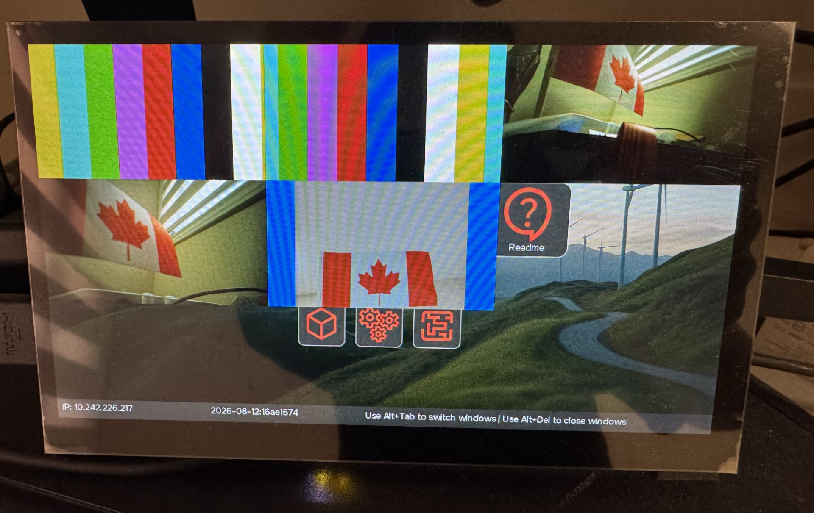

id: configure-multiple-camera-sources-on-RPI5
title: Configure multiple camera sources on Raspberry Pi 5
summary: Learn how to configure multiple camera sources on a Raspberry Pi 5 target with QNX 8.0.
categories: codelabs, setup, qnx-sensor-framework, camera
tags: beginner
difficulty: 1
status: published
authors: Terence Ang
feedback_link: https://github.com/qnx/codelabs/issues


# Configure multiple camera sources on Raspberry Pi 5

## Introduction
This codelab describes how to configure multiple camera sources on the Raspberry Pi 5. The instructions provided in this codelab enable support for multiple camera inputs.

## Prerequisites
### Hardware
- 1 x Raspberry Pi 5
- 2 x Camera Module 3 units
- 1 x Logitech C920x (or C920)

### Quick Start Target Image (QSTI)
- On the host, launch QNX Software Center and install the QSTI image for QNX 8.0, for example:
com.qnx.qnx800.quickstart.rpi5/0.5.0.00025T202608191358L
- Use Raspberry Pi Imager or another imaging tool to write the image to the SD card.
- Insert the SD card into the Raspberry Pi 5.
- Connect the two Camera Module 3 units and the C920 USB camera.
- Power on the Raspberry Pi 5.

### Dependent packages
The required packages are already installed. In the case that you need re-installation, install the following packages:
```sh
sudo apk add \
    yaml \
    libturbojpeg \
    qnx-egl \
    qnx-gles \
    qnx-screen \
    qnx-devu-hcd-dwc3-xhci \
    qnx-rpi-camera-ipa \
    qnx-io-usb-otg \
    qnx-usb \
    qnx-multimedia-framework \
    qnx-sensor-framework \
    qnx-sensor-framework-utils \
    qnx-sensor-framework-example-configs \
    qnx-sf-camera-imx708 \
    qnx-sf-platform-broadcom-rpi5
```

## Hardware Configuration
### Connect two Camera Module 3 units to the DISP0 and DISP1 ports as shown below:


### Connect the Logitech C920x (or C920) to one of the USB ports as shown below:


## Validate Configuration

### Verify that the sensor service is running
Run `sudo pidin ar | grep sensor`

You should see output similar to the following:
```sh
[qnxuser@qnxpi ~]$ sudo pidin ar | grep sensor
  913444 sensor -U 521:521 -b external -r /data/share/sensor -c /etc/config/sensor/sensor_rpi5.conf
```

### Verify that the I2C interfaces are configured correctly with `-q0xa8`, `-q0xab` and `-q0xad`
```sh
[qnxuser@qnxpi ~]$ sudo pidin ar | grep i2c-dwc-rpi5
  671765 /system/bin/i2c-dwc-rpi5 -p0x1f00074000 -c200000000 -q0xa8
  856098 /system/bin/i2c-dwc-rpi5 -p0x1f00080000 -c200000000 -q0xab
  884771 /system/bin/i2c-dwc-rpi5 -p0x1f00088000 -c200000000 -q0xad
```

### Verify that camera sensor devices are available
Run `ls -al /dev/sensor`

You should see `camera1` through `camera5`.
```sh
[qnxuser@qnxpi ~]$ ls -al /dev/sensor
total 0
-rw-rw----  1 521 sensor 0 1970-01-01 00:00 camera1
-rw-rw----  1 521 sensor 0 1970-01-01 00:00 camera2
-rw-rw----  1 521 sensor 0 1970-01-01 00:00 camera3
-rw-rw----  1 521 sensor 0 1970-01-01 00:00 camera4
-rw-rw----  1 521 sensor 0 1970-01-01 00:00 camera5
-rw-rw----  1 521 sensor 0 1970-01-01 02:20 data1
-rw-rw----  1 521 sensor 0 1970-01-01 02:20 data2
```

### Verify that the IRQs are enabled for the two Camera Module 3 units
Run `sudo msix-rp1 | grep -E "I2C4|I2C6|MIPI0|MIPI1`

You should see output similar to the following:
```sh
[qnxuser@qnxpi ~]$ sudo msix-rp1 | grep -E "I2C4|I2C6|MIPI0|MIPI1"
  11 |             I2C4 | -EI | **-Ml | *l
  13 |             I2C6 | -EI | **-Ml | *l
  47 |            MIPI0 | -EI | ---Me | -e
  48 |            MIPI1 | -EI | ---Me | -e
```

## Launch the cameras
In this configuration, the cameras are assigned as follows:
- camera 1: simulation camera
- camera 2: video playback camera
- camera 3: Camera Module 3 connected to DISP0
- camera 4: Camera Module 3 connected to DISP1
- camera 5: Logitech C920x (or C920) USB camera

### Run `camera_example3_viewfinder -u N`, where N is the camera number
Run the commands one by one to view each camera.
```sh
[qnxuser@qnxpi ~]$ camera_example3_viewfinder -u 1 &
...
[qnxuser@qnxpi ~]$ camera_example3_viewfinder -u 2 &
...
[qnxuser@qnxpi ~]$ camera_example3_viewfinder -u 3 &
...
[qnxuser@qnxpi ~]$ camera_example3_viewfinder -u 4 &
...
[qnxuser@qnxpi ~]$ camera_example3_viewfinder -u 5 &
...
```

### Verify that the background processes are running
```sh
[qnxuser@qnxpi ~]$ pidin ar | grep camera_example3_viewfinder
1679412 camera_example3_viewfinder -u 1
1683509 camera_example3_viewfinder -u 2
1687606 camera_example3_viewfinder -u 3
1691703 camera_example3_viewfinder -u 4
1687606 camera_example3_viewfinder -u 5
```

### Switch between cameras
If a USB keyboard is connected to the Raspberry Pi 5, you can press `Alt` + `Tab` to switch between cameras.


### Multiplex the cameras
Stop the `camera_example3_viewfinder` applications with `slay camera_example3_viewfinder`. When prompted, answer `Y` for each process.

```sh
[qnxuser@qnxpi ~]$ slay camera_example3_viewfinder
slay: usr/bin/camera_example3_viewfinder 1679412 on (tty not known) (y/N)? Y
slay: usr/bin/camera_example3_viewfinder 1683509 on (tty not known) (y/N)? Y
slay: usr/bin/camera_example3_viewfinder 1687606 on (tty not known) (y/N)? Y
slay: usr/bin/camera_example3_viewfinder 1691703 on (tty not known) (y/N)? Y
slay: usr/bin/camera_example3_viewfinder 1687606 on (tty not known) (y/N)? Y
```

Alternatively, you can force-stop the `camera_example3_viewfinder` applications without being prompted by using `slay -f camera_example3_viewfinder`.
```sh
[qnxuser@qnxpi ~]$ slay -f camera_example3_viewfinder
slay: usr/bin/camera_example3_viewfinder 10252340 on (tty not known)
slay: usr/bin/camera_example3_viewfinder 10256437 on (tty not known)
slay: usr/bin/camera_example3_viewfinder 10260534 on (tty not known)
slay: usr/bin/camera_example3_viewfinder 10264631 on (tty not known)
slay: usr/bin/camera_example3_viewfinder 10268728 on (tty not known)
```
Test whether the cameras can be multiplexed simultaneously with `camera_mux -n N`, where N is the total number of cameras to be multiplexed.

However, the `fullscreen-winmgr` process currently prevents this.

Stop the `fullscreen-winmgr` process before multiplexing the camera streams.
```sh
[qnxuser@qnxpi ~]$ sudo slay fullscreen-winmgr
[qnxuser@qnxpi ~]$ camera_mux -n 5
```

The following image shows five cameras being multiplexed:


## Troubleshooting
### Verify that the two Camera Module 3 units are detected
Run `sudo slog2info -b sensor_service | grep -E "Camera 3|Camera 4"`
You should see output similar to the following:
```sh
[qnxuser@qnxpi ~]$ sudo slog2info -b sensor_service | grep -E "Camera 3|Camera 4"
Jan 01 00:00:05.273          sensor_service.852004                debug      1  [ext]int getResolutions(platform_external_handle_t, fsp_sensor_UnitType, fsp_sensor_FormatType, int*, const fsp_sensor_ResType**)(966): Camera 3: 2 resolutions for type 1
Jan 01 00:00:05.273          sensor_service.852004                debug      1  [ext]int getFramerates(platform_external_handle_t, fsp_sensor_UnitType, fsp_sensor_ResType*, fsp_sensor_FormatType, int*, bool*, float*)(1010): Camera 3: rates 1, type 1, resolution 2304 x 1296 maxmin 0
Jan 01 00:00:05.273          sensor_service.852004                debug      1  [ext]int getResolutions(platform_external_handle_t, fsp_sensor_UnitType, fsp_sensor_FormatType, int*, const fsp_sensor_ResType**)(966): Camera 4: 2 resolutions for type 1
Jan 01 00:00:05.273          sensor_service.852004                debug      1  [ext]int getFramerates(platform_external_handle_t, fsp_sensor_UnitType, fsp_sensor_ResType*, fsp_sensor_FormatType, int*, bool*, float*)(1010): Camera 4: rates 1, type 1, resolution 2304 x 1296 maxmin 0


```
If either of the Camera Module 3 units is not detected, inspect the ribbon cables to ensure that they are firmly connected to the Raspberry Pi 5 ports.

### Verify that the Logitech camera is detected
Run `usb` or `usb -vvv` for more detailed information.

You should see output similar to the following:
```sh
...
USB 1 (XHCI) v10.00, v1.01 DDK, v2.00 HCD, DLL: Active

Device Address             : 1
Vendor                     : 0x046d (Logitech)
Product                    : 0x08e5 (HD Pro Webcam C920)
Class                      : 0xef (Miscellaneous)
Subclass                   : 0x02
Protocol                   : 0x01
...
```
