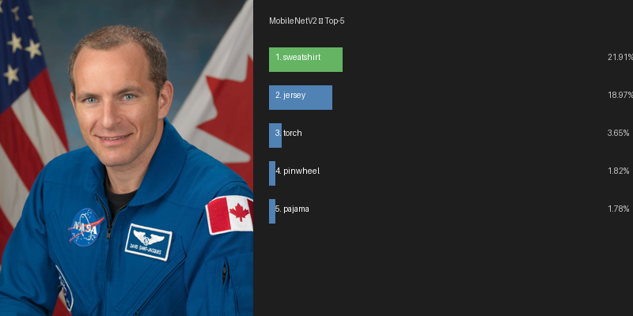
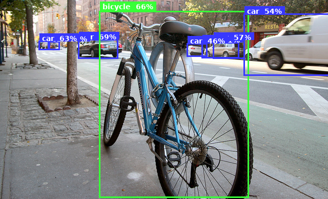
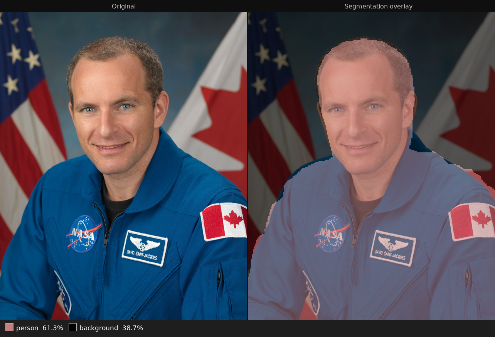

id: mobilenet-tflite-qnx
title: Running MobileNet Inference on QNX with TensorFlow Lite
summary: Run image classification, object detection, and semantic segmentation on QNX 8.0 using the TFLite runtime and MobileNet family models.
categories: qnx, ai
tags: intermediate
difficulty: 2
status: published
authors: Cris Sinnott
feedback_link: https://github.com/qnx/codelabs/issues

# Machine Learning Inference on QNX with TensorFlow Lite

## Introduction

TensorFlow Lite (TFLite) is a lightweight ML inference runtime designed for edge and embedded platforms. The `tflite-runtime` package in the QNX aports repository brings TFLite to QNX 8.0, including the XNNPACK neural network backend for multi-threaded CPU inference.

This codelab walks through three classic computer vision tasks — image classification, object detection, and semantic segmentation — each backed by a different MobileNet-family model. It finishes with a combined benchmark so you can measure throughput on your target.

### What you will learn

* How to install `tflite-runtime` on QNX 8.0 and verify the Python binding
* How the TFLite `Interpreter` API works: tensors, shapes, dtypes, and delegates
* How to pre-process images and decode outputs for classification, detection, and segmentation
* How to measure inference throughput with XNNPACK on QNX

### Prerequisites

* A QNX 8.0 target — this codelab is validated on both a Raspberry Pi 5 and an x86\_64 QEMU VM
* The `qnx-ports` APK repository configured on the target
* Basic familiarity with SSH and Python 3
* A JPEG or PNG test image available on the target

> **Note on hardware:** This codelab uses CPU inference via XNNPACK, which runs on any QNX 8.0 target regardless of GPU. Benchmark numbers are shown for both Raspberry Pi 5 (aarch64, Cortex-A76) and a 4-vCPU x86\_64 QEMU VM.

---

## Install TFLite Runtime

Install the TFLite runtime and its Python bindings from the `qnx-ports` APK repository.

```sh
apk add tflite-runtime python3-tflite-runtime python3-numpy python3-pillow
```

Verify the installation:

```sh
python3 -c "import tflite_runtime.interpreter as tflite; print('TFLite OK')"
```

You should see:

```
TFLite OK
```

If the import fails, confirm the `qnx-ports` repository is enabled:

```sh
cat /etc/apk/repositories
```

The `qnx-ports` community repository URL should be present. If it is not, add it and run `apk update` before retrying.

---

## Download Models and Test Data

The models used in this codelab are from the [TFLite Model Zoo](https://ai.google.dev/edge/litert/models/trained). Run the following commands on your QNX target.

```sh
cd ~

# MobileNetV2 — image classification (float32, ~14 MB)
curl -sL -o mobilenet_v2.tflite \
  "https://storage.googleapis.com/download.tensorflow.org/models/mobilenet_v2_1.0_224.tflite"

# ImageNet labels (1001 classes, line 0 = background)
curl -sL -o labels.txt \
  "https://storage.googleapis.com/download.tensorflow.org/data/ImageNetLabels.txt"

# SSD MobileNet V1 — object detection (uint8, COCO, ~7 MB)
curl -sL -o detect.zip \
  "https://storage.googleapis.com/download.tensorflow.org/models/tflite/coco_ssd_mobilenet_v1_1.0_quant_2018_06_29.zip"
unzip -o detect.zip detect.tflite && rm detect.zip

# COCO labelmap
curl -sL -o labelmap.txt \
  "https://storage.googleapis.com/download.tensorflow.org/models/tflite/coco_ssd_mobilenet_v1_1.0_quant_2018_06_29/labelmap.txt"

# DeepLab v3 — semantic segmentation (float32, PASCAL VOC, ~3.5 MB)
curl -sL -o deeplabv3_257.tflite \
  "https://storage.googleapis.com/download.tensorflow.org/models/tflite/gpu/deeplabv3_257_mv_gpu.tflite"
```

You also need a test image. Any JPEG photograph works. A portrait with a clearly visible person gives the best results across all three tasks. Copy one from your host:

```sh
scp /path/to/photo.jpg qnxuser@<target-ip>:~/test.jpg
```

The examples in this codelab use a NASA portrait of Canadian astronaut David Saint-Jacques (public domain). Download it directly on your target:

```sh
curl -sL -o test.jpg \
  "https://upload.wikimedia.org/wikipedia/commons/f/f8/David_Saint-Jacques_official_portrait.jpg"
```

Confirm everything is in place:

```sh
ls -lh ~/*.tflite ~/labels.txt ~/labelmap.txt
```

---

## Image Classification

[Image classification](https://huggingface.co/tasks/image-classification) answers: *what is the dominant object in this image?*

MobileNetV2 was trained on ImageNet — 1000 everyday object categories plus a catch-all background class for images that don't clearly belong to any of them. Given a photograph, it returns a confidence score for each class; the highest score is the model's prediction.

The model requires colour images resized to exactly 224×224 pixels, with each pixel value expressed as a decimal in the range 0.0–1.0 rather than the standard 0–255 integer. This scaling is called normalisation — it must match what the model saw during training, otherwise predictions will be wrong. The `classify.py` script handles both the resizing and normalisation automatically before running inference.



### Inspect the model

Before writing inference code it is useful to look at the model's tensor shapes:

```sh
python3 - << 'EOF'
import tflite_runtime.interpreter as tflite

interp = tflite.Interpreter(model_path='mobilenet_v2.tflite', num_threads=4)
interp.allocate_tensors()

inp = interp.get_input_details()[0]
out = interp.get_output_details()[0]
print(f"Input  #{inp['index']}: shape={inp['shape']}  dtype={inp['dtype'].__name__}")
print(f"Output #{out['index']}: shape={out['shape']}  dtype={out['dtype'].__name__}")
EOF
```

```
Input  #0: shape=[1, 224, 224, 3]  dtype=float32
Output #0: shape=[1, 1001]  dtype=float32
```

The input shape `[1, 224, 224, 3]` encodes one 224×224 colour image. The four dimensions are `[batch, height, width, channels]`:

* **batch** — how many images are passed in a single call. We use `1` because on a device we classify one image at a time. During model training, large batches are processed simultaneously for efficiency; at inference we don't need that.
* **height / width** — the fixed pixel dimensions the model was trained on. Any input image must be resized to 224×224 before it can be passed in.
* **channels** — the three colour planes: Red, Green, and Blue. The model was trained on colour images and expects all three.

The output shape `[1, 1001]` is one confidence score per class — the 1000 ImageNet categories plus the background class — for each image in the batch.

### Write and run the classifier

Create `~/classify.py`:

```python
import sys
import numpy as np
from PIL import Image
import tflite_runtime.interpreter as tflite

MODEL  = 'mobilenet_v2.tflite'
LABELS = 'labels.txt'
IMAGE  = sys.argv[1] if len(sys.argv) > 1 else 'test.jpg'

# Load class labels — one name per line; the index matches the model's output position
with open(LABELS) as f:
    labels = [l.strip() for l in f]

# Load the model and allocate memory for its input/output tensors
# num_threads=4 enables XNNPACK multi-threaded CPU inference
interp = tflite.Interpreter(model_path=MODEL, num_threads=4)
interp.allocate_tensors()

# Read the input dimensions directly from the model so the script works with any TFLite model
inp = interp.get_input_details()[0]
out = interp.get_output_details()[0]
h, w = inp['shape'][1], inp['shape'][2]

# Resize the image to the model's required dimensions, then normalise pixels from 0–255 to 0.0–1.0
img  = Image.open(IMAGE).convert('RGB').resize((w, h))
data = np.expand_dims(np.array(img, dtype=np.float32) / 255.0, axis=0)

# Copy the prepared image into the model's input tensor and run inference
interp.set_tensor(inp['index'], data)
interp.invoke()

# Read the output scores and rank the top 5 classes in descending order
scores = interp.get_tensor(out['index'])[0]
top5   = np.argsort(scores)[::-1][:5]

print(f"Image: {IMAGE}")
print("Top-5 predictions:")
for rank, idx in enumerate(top5, 1):
    name = labels[idx] if idx < len(labels) else f'class_{idx}'
    print(f"  {rank}. {name:<40} {scores[idx]*100:.2f}%")
```

Run it from your home directory:

```sh
cd ~ && python3 classify.py test.jpg
```

Expected output for the Saint-Jacques portrait:

```
Image: test.jpg
Top-5 predictions:
  1. sweatshirt                                21.91%
  2. jersey                                    18.97%
  3. torch                                     3.65%
  4. pinwheel                                  1.82%
  5. pajama                                    1.78%
```

> **Note:** MobileNetV2 was trained on everyday ImageNet categories and has no "flight suit" class. It maps the blue NASA uniform to the closest it has seen — sweatshirt and jersey — which together account for ~41% of the confidence. The remaining predictions reflect confusion from the NASA and CSA patches visible on the suit.

The key TFLite API calls used here are:

| Call | Purpose |
| :--- | :--- |
| `Interpreter(model_path, num_threads=4)` | Load the flatbuffer model; set CPU thread count for XNNPACK |
| `allocate_tensors()` | Allocate input/output buffers — must be called before use |
| `set_tensor(index, data)` | Copy a numpy array into an input buffer |
| `invoke()` | Run the full inference graph |
| `get_tensor(index)` | Read an output buffer into a numpy array |

---

## Object Detection

[Object detection](https://huggingface.co/tasks/object-detection) answers: *where are objects in this image, and what are they?*

SSD MobileNet V1 was trained on COCO — Common Objects in Context, a dataset covering 80 everyday categories such as people, vehicles, and furniture. Unlike the classifier, which produces a single answer for the whole image, the detector reports every object it finds, each described by four pieces of information: where it is (a bounding box), what it is (a class label), how confident the model is (a score), and a total count of valid detections.

This model is *quantised* — its weights have been compressed to use 8-bit integers rather than 32-bit decimals, making it smaller and faster. As a result it expects raw pixel bytes (0–255) as input rather than the normalised decimals used by MobileNetV2. The model handles the internal scaling itself.



### Inspect the model

```sh
python3 - << 'EOF'
import tflite_runtime.interpreter as tflite

interp = tflite.Interpreter(model_path='detect.tflite', num_threads=4)
interp.allocate_tensors()

for d in interp.get_input_details():
    print(f"Input  #{d['index']}: shape={d['shape']}  dtype={d['dtype'].__name__}")
for d in interp.get_output_details():
    print(f"Output #{d['index']}: shape={d['shape']}  dtype={d['dtype'].__name__}")
EOF
```

```
Input  #0: shape=[1, 300, 300, 3]  dtype=uint8
Output #0: shape=[1, 10, 4]  dtype=float32   ← bounding boxes [ymin, xmin, ymax, xmax]
Output #1: shape=[1, 10]     dtype=float32   ← class IDs
Output #2: shape=[1, 10]     dtype=float32   ← confidence scores
Output #3: shape=[1]         dtype=float32   ← detection count
```

The input shape follows the same `[batch, height, width, channels]` pattern as the classifier, but this model requires 300×300 images. The four output tensors each contain 10 slots — the model always fills all 10, and the final tensor (shape `[1]`) tells you how many of those slots hold real detections. The rest can be ignored.

| Output | Shape | Contents |
| :--- | :--- | :--- |
| `outs[0]` | `[1, 10, 4]` | Bounding box per detection — four coordinates (top, left, bottom, right) as fractions of the image size |
| `outs[1]` | `[1, 10]` | Class ID for each detection slot |
| `outs[2]` | `[1, 10]` | Confidence score for each detection slot |
| `outs[3]` | `[1]` | Number of valid detections in the 10 slots |

> **uint8 input:** Unlike `classify.py`, this script passes raw pixel integers (0–255) directly to the model. No normalisation step is needed — the scaling is built into the model's quantised weights.

> **Label offset:** The `labelmap.txt` file has a background class `???` at line 0 and real COCO classes from line 1 onward. The model outputs 0-indexed class IDs where 0 = the first real class ("person"), so add 1 when indexing into the label file.

### Write and run the detector

Create `~/detect.py`:

```python
import sys
import numpy as np
from PIL import Image
import tflite_runtime.interpreter as tflite

MODEL    = 'detect.tflite'
LABELMAP = 'labelmap.txt'
IMAGE    = sys.argv[1] if len(sys.argv) > 1 else 'test.jpg'

# Load COCO labels — line 0 is a "???" background placeholder; real class names start at line 1
with open(LABELMAP) as f:
    coco = [l.strip() for l in f]

# Load the model and allocate memory for its input/output tensors
interp = tflite.Interpreter(model_path=MODEL, num_threads=4)
interp.allocate_tensors()

# This model has four output tensors; get_output_details() returns all of them as a list
inp  = interp.get_input_details()[0]
outs = interp.get_output_details()
_, h, w, _ = inp['shape']

# Detection model expects raw uint8 pixels (0–255), not normalised floats
img  = Image.open(IMAGE).convert('RGB').resize((w, h))
data = np.expand_dims(np.array(img, dtype=np.uint8), axis=0)

# Copy the prepared image into the model's input tensor and run inference
interp.set_tensor(inp['index'], data)
interp.invoke()

# Unpack the four output tensors: bounding boxes, class IDs, confidence scores, detection count
boxes   = interp.get_tensor(outs[0]['index'])[0]       # [10, 4] — box corners as image fractions
classes = interp.get_tensor(outs[1]['index'])[0]       # [10]   — class index per detection
scores  = interp.get_tensor(outs[2]['index'])[0]       # [10]   — confidence score per detection
count   = int(interp.get_tensor(outs[3]['index'])[0])  # number of valid detections returned

print(f"Image: {IMAGE}  ({count} detections)")
print(f"{'#':<3} {'Class':<20} {'Score':>7}  Box [ymin, xmin, ymax, xmax]")
for i in range(count):
    cls_id = int(classes[i])
    # Add 1 to skip the background placeholder at line 0 of the label file
    label  = coco[cls_id + 1] if (cls_id + 1) < len(coco) else f'cls_{cls_id}'
    ymin, xmin, ymax, xmax = boxes[i]
    print(f"  {i+1:<2} {label:<20} {scores[i]*100:>6.1f}%  "
          f"[{ymin:.2f}, {xmin:.2f}, {ymax:.2f}, {xmax:.2f}]")
```

Run it:

```sh
cd ~ && python3 detect.py test.jpg
```

Example output for a street scene:

```
Image: test.jpg  (5 detections)
#   Class                 Score  Box [ymin, xmin, ymax, xmax]
  1  car                  71.1%  [0.38, 0.72, 0.93, 1.00]
  2  car                  68.8%  [0.34, 0.00, 0.89, 0.32]
  3  car                  66.8%  [0.35, 0.40, 0.87, 0.71]
  4  bicycle              65.6%  [0.10, 0.18, 0.98, 0.88]
  5  car                  63.3%  [0.37, 0.44, 0.81, 0.64]
```

Bounding box coordinates are fractions of the image dimensions. Multiply by pixel width/height to get pixel coordinates.

---

## Semantic Segmentation

[Semantic segmentation](https://huggingface.co/tasks/image-segmentation) answers: *what class does each pixel belong to?*

DeepLab v3 was trained on PASCAL VOC — a dataset covering 21 categories including people, animals, and common vehicles. Rather than labelling the image as a whole, it assigns a category to every individual pixel, producing a complete map of what is where in the scene.

For each pixel in the 257×257 output grid, the model produces a raw score for all 21 possible categories. The script then picks the category with the highest score at each pixel — a step called `argmax` — resulting in a 257×257 grid where every cell contains a single category label. The output tensor shape `[1, 257, 257, 21]` encodes this directly: one image, 257×257 pixel positions, 21 scores per position.



The 21 categories are: background (catch-all for pixels that don't match any category), aeroplane, bicycle, bird, boat, bottle, bus, car, cat, chair, cow, diningtable, dog, horse, motorbike, person, pottedplant, sheep, sofa, train, tvmonitor.

> **Different normalisation:** MobileNetV2 scales pixel values to the range 0.0–1.0 by dividing by 255. DeepLab uses a different range, −1.0 to 1.0, achieved with `(pixel / 127.5) − 1.0`. Using the wrong formula produces incorrect segmentation maps — the two models were trained differently and each expects its own scale.

### Write and run the segmentation script

Create `~/segment.py`:

```python
import sys
import numpy as np
from PIL import Image
import tflite_runtime.interpreter as tflite

MODEL  = 'deeplabv3_257.tflite'
IMAGE  = sys.argv[1] if len(sys.argv) > 1 else 'test.jpg'

# The 21 PASCAL VOC classes this model was trained to recognise — index matches the model's class axis
PASCAL = [
    'background', 'aeroplane', 'bicycle', 'bird', 'boat', 'bottle',
    'bus', 'car', 'cat', 'chair', 'cow', 'diningtable', 'dog', 'horse',
    'motorbike', 'person', 'pottedplant', 'sheep', 'sofa', 'train', 'tvmonitor'
]

# Load the model and allocate memory for its input/output tensors
interp = tflite.Interpreter(model_path=MODEL, num_threads=4)
interp.allocate_tensors()

inp = interp.get_input_details()[0]
out = interp.get_output_details()[0]
_, h, w, _ = inp['shape']

# Resize and normalise to the range [-1, 1] — DeepLab uses a different scale than MobileNetV2
img  = Image.open(IMAGE).convert('RGB').resize((w, h))
data = np.expand_dims((np.array(img, dtype=np.float32) / 127.5) - 1.0, axis=0)

# Copy the prepared image into the model's input tensor and run inference
interp.set_tensor(inp['index'], data)
interp.invoke()

# The output holds a score for each of 21 classes at every pixel position
# argmax picks the class with the highest score, giving one class ID per pixel
logits  = interp.get_tensor(out['index'])        # [1, 257, 257, 21]
seg_map = np.argmax(logits[0], axis=-1)          # [257, 257] — one class ID per pixel

# Count how many pixels were assigned to each class and report the top 3
total = seg_map.size
unique, counts = np.unique(seg_map, return_counts=True)
top3  = sorted(zip(counts, unique), reverse=True)[:3]

print(f"Image: {IMAGE}  (segmented at {w}×{h})")
print("Top-3 pixel classes:")
for n, cls_id in top3:
    name = PASCAL[cls_id] if cls_id < len(PASCAL) else f'cls_{cls_id}'
    print(f"  {name:<15} {n/total*100:.1f}% of pixels")
```

Run it:

```sh
cd ~ && python3 segment.py test.jpg
```

Expected output for the Saint-Jacques portrait:

```
Image: test.jpg  (segmented at 257×257)
Top-3 pixel classes:
  person          61.3% of pixels
  background      38.7% of pixels
```

### Save a colour-coded segmentation map

Add these lines at the end of `segment.py` to write a PNG where each class gets a distinct colour:

```python
# One RGB colour per PASCAL VOC class — index matches the class ID in seg_map
COLOURS = [
    (0,0,0),(128,0,0),(0,128,0),(128,128,0),(0,0,128),(128,0,128),
    (0,128,128),(128,128,128),(64,0,0),(192,0,0),(64,128,0),(192,128,0),
    (64,0,128),(192,0,128),(64,128,128),(192,128,128),(0,64,0),(128,64,0),
    (0,192,0),(128,192,0),(0,64,128),
]
# Use each pixel's class ID as an index into the colour table to produce an RGB image
seg_rgb = np.array(COLOURS, dtype=np.uint8)[seg_map]
Image.fromarray(seg_rgb).save('segmentation.png')
print("Colour map saved to segmentation.png")
```

---

## Benchmark All Three Tasks

Now that the three tasks work individually, combine them into a single benchmark to measure steady-state inference throughput.

Create `~/benchmark.py`:

```python
import sys, time
import numpy as np
from PIL import Image
import tflite_runtime.interpreter as tflite

IMAGE = sys.argv[1] if len(sys.argv) > 1 else 'test.jpg'
N     = 10  # number of timed inference runs per task

PASCAL = [
    'background', 'aeroplane', 'bicycle', 'bird', 'boat', 'bottle',
    'bus', 'car', 'cat', 'chair', 'cow', 'diningtable', 'dog', 'horse',
    'motorbike', 'person', 'pottedplant', 'sheep', 'sofa', 'train', 'tvmonitor'
]

# Load label files once; each task function reuses the appropriate list
with open('labels.txt')   as f: imagenet = [l.strip() for l in f]
with open('labelmap.txt') as f: coco     = [l.strip() for l in f]


def timed(interp, n):
    # Run inference n times and return each duration in milliseconds
    times = []
    for _ in range(n):
        t0 = time.perf_counter()
        interp.invoke()
        times.append((time.perf_counter() - t0) * 1000)
    return times


def run_classify():
    interp = tflite.Interpreter(model_path='mobilenet_v2.tflite', num_threads=4)
    interp.allocate_tensors()
    inp = interp.get_input_details()[0]
    out = interp.get_output_details()[0]
    h, w = inp['shape'][1], inp['shape'][2]
    data = np.expand_dims(
        np.array(Image.open(IMAGE).convert('RGB').resize((w, h)),
                 dtype=np.float32) / 255.0, 0)
    interp.set_tensor(inp['index'], data)
    interp.invoke()          # one warmup run — compiles XNNPACK kernels
    times  = timed(interp, N)
    scores = interp.get_tensor(out['index'])[0]
    return times, imagenet[np.argmax(scores)]


def run_detect():
    interp = tflite.Interpreter(model_path='detect.tflite', num_threads=4)
    interp.allocate_tensors()
    inp  = interp.get_input_details()[0]
    outs = interp.get_output_details()
    _, h, w, _ = inp['shape']
    data = np.expand_dims(
        np.array(Image.open(IMAGE).convert('RGB').resize((w, h)),
                 dtype=np.uint8), 0)
    interp.set_tensor(inp['index'], data)
    interp.invoke()          # warmup
    times   = timed(interp, N)
    # Report the label of the highest-scoring detection
    classes = interp.get_tensor(outs[1]['index'])[0]
    scores  = interp.get_tensor(outs[2]['index'])[0]
    idx     = int(classes[np.argmax(scores)])
    return times, coco[idx + 1] if (idx + 1) < len(coco) else f'cls_{idx}'


def run_segment():
    interp = tflite.Interpreter(model_path='deeplabv3_257.tflite', num_threads=4)
    interp.allocate_tensors()
    inp = interp.get_input_details()[0]
    out = interp.get_output_details()[0]
    _, h, w, _ = inp['shape']
    data = np.expand_dims(
        (np.array(Image.open(IMAGE).convert('RGB').resize((w, h)),
                  dtype=np.float32) / 127.5) - 1.0, 0)
    interp.set_tensor(inp['index'], data)
    interp.invoke()          # warmup
    times   = timed(interp, N)
    # Report the class that covers the most pixels
    seg_map = np.argmax(interp.get_tensor(out['index'])[0], axis=-1)
    top1_id = int(np.bincount(seg_map.flatten()).argmax())
    return times, PASCAL[top1_id] if top1_id < len(PASCAL) else f'cls_{top1_id}'


import platform
print(f"\nTFLite MobileNet Benchmark  —  {platform.system()} {platform.release()}")
print(f"Image: {IMAGE}    Runs per task: {N}\n")

TASKS = [
    ('Classification  (MobileNetV2 224)',   run_classify),
    ('Detection       (SSD MobileNet 300)', run_detect),
    ('Segmentation    (DeepLab v3 257)',    run_segment),
]

# Run each task, collect timing, and print a summary table
results = []
for name, fn in TASKS:
    print(f"  Running {name} ...", end=' ', flush=True)
    times, top1 = fn()
    avg = sum(times) / len(times)
    print(f"{avg:5.1f} ms  →  {top1}")
    results.append((name, avg, top1))

print(f"\n{'Task':<42} {'Avg':>8}  {'FPS':>7}  Top result")
print('─' * 78)
for name, avg, top1 in results:
    print(f"  {name:<40} {avg:>7.1f}ms  {1000/avg:>6.1f}  {top1}")
print()
```

Run the benchmark from your home directory:

```sh
cd ~ && python3 benchmark.py test.jpg
```

### Raspberry Pi 5 (Cortex-A76, 4 cores)

```
TFLite MobileNet Benchmark  —  QNX 8.0.0

Task                                       Avg (ms)     FPS  Top result
──────────────────────────────────────────────────────────────────────────────
  Classification  (MobileNetV2 224)           24.2    41.4  sweatshirt
  Detection       (SSD MobileNet 300)         38.3    26.1  person
  Segmentation    (DeepLab v3 257)            48.0    20.8  person
```

### x86_64 QEMU VM (4 vCPUs)

```
TFLite MobileNet Benchmark  —  QNX 8.0.5

Task                                       Avg (ms)     FPS  Top result
──────────────────────────────────────────────────────────────────────────────
  Classification  (MobileNetV2 224)            5.6   179.1  sweatshirt
  Detection       (SSD MobileNet 300)         16.1    62.0  person
  Segmentation    (DeepLab v3 257)            10.4    96.5  person
```

> **Note on FPS:** The FPS column is a projected figure — `1000 ÷ avg_ms` — representing how many frames per second the model alone could sustain if fed images back-to-back with no other overhead. In practice a real camera pipeline also pays for frame capture, colour conversion, and OS scheduling, so effective throughput will be lower. That said, classification at ~41 FPS and detection at ~26 FPS on the Raspberry Pi 5 leave meaningful headroom against a standard 30fps camera feed, making these models practical for real-time use on the target.

> **Tip:** Run the benchmark a second time to see steady-state numbers. The first run includes Python import overhead and XNNPACK kernel cache warm-up. Subsequent runs are representative of production throughput.

---

## Summary

You installed and ran three TFLite MobileNet-family models on QNX 8.0 using CPU inference via the XNNPACK delegate.

### Key points to carry forward

* **The TFLite API is the same on QNX as any other platform.** Models, scripts, and label files developed on a Linux workstation transfer to QNX without modification.
* **Each task requires different pre-processing.** Classification scales pixels to 0.0–1.0; detection passes raw uint8 pixels unchanged; segmentation scales to −1.0 to 1.0. Using the wrong scale for any model produces wrong results.
* **Always run one warmup `invoke()` before timing.** The first call compiles XNNPACK kernels; subsequent calls represent steady-state latency.
* **`num_threads=4` enables XNNPACK multi-threaded inference.** Match this to the core count of your target for best throughput.
* **MobileNet-class models run well on embedded QNX targets.** The Raspberry Pi 5 delivers ~41 FPS for image classification and ~21–26 FPS for detection and segmentation — sufficient for real-time camera pipelines when combined with efficient capture and decode.

### Visualization scripts

The composite result images shown in this codelab were generated with standalone PIL scripts. If you want to produce the same images on your target, the scripts are in the [`scripts/`](https://github.com/qnx/codelabs/tree/main/markdown/mobilenet-tflite-qnx/scripts) directory alongside this codelab's source: `classify_viz.py`, `detect_viz.py`, and `segment_viz.py`. Each script takes `[image] [output]` arguments and uses only the packages already installed.

### What to explore next

* **Quantised models** — uint8 variants of MobileNetV2 are 4× smaller and typically 2–3× faster; the API is identical.
* **EfficientNet-Lite0/2** — higher accuracy than MobileNetV2 at similar latency; the `classify.py` script works without changes.
* **Camera pipeline** — the models in this codelab run fast enough for real-time camera input on the Raspberry Pi 5. The [MediaPipe Camera Sample](https://qnx.github.io/codelabs/mediapipe-camera-sample/) codelab is the natural next step: it wires a live camera feed into a MediaPipe detection graph running on QNX, building directly on the inference concepts covered here.
