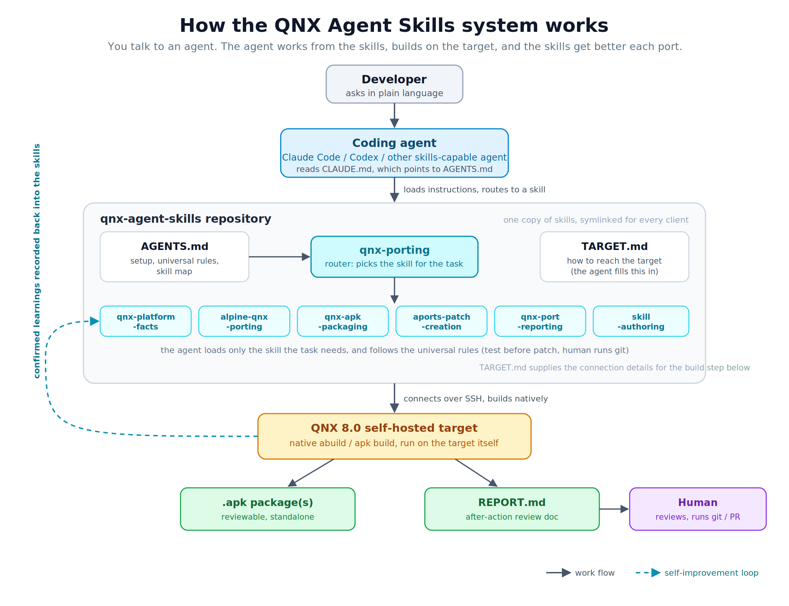

id: qnx-agent-skills
title: Set up the QNX agent-skills repository
summary: Clone the qnx-agent-skills repository, understand how its skills are organized, point Claude Code or Codex (or another skills-capable agent) at it, and use it to drive native aports porting work on a QNX 8.0 self-hosted target
categories: qnx, ai, codelabs
tags: intermediate
difficulty: 2
status: published
authors: Elliott Mazzuca
feedback_link: https://github.com/qnx/codelabs/issues


# Set up the QNX agent-skills repository

## Introduction
Duration: 2:00

A coding agent on its own knows little that is specific to QNX and tends to fall back on Linux assumptions. The `qnx-agent-skills` repository fixes that: it is a drop-in set of QNX skills that turns a skills-capable agent into a QNX 8.0 porting companion, covering platform facts, Alpine aports porting, packaging, patch creation, and port reporting.

**What you will learn:**

* Where the repository lives and how to clone it
* How the skills are organized, and how the agent navigates them
* Which agents are supported, and how others can use it
* How to point your agent at the repository and tell it about your target
* The three prompts that take you from a fresh clone to a validated port
* Sample tasks the skill set drives, from adapting an APKBUILD to the validation gate

**Prerequisites:**

* A QNX 8.0 self-hosted target (a Quick Start Target Image or Custom Target Image on QEMU or Raspberry Pi).
* A skills-capable agent (Claude Code or Codex) installed on your development host. The agent connects over SSH to the QNX self-hosted target, where builds run natively.
* `git`, and `sshpass` if you use password-based SSH to the target.

Here is the whole flow at a glance:



---

## Get the repository
Duration: 2:00

```bash
git clone https://github.com/qnx-ports/qnx-agent-skills.git
cd qnx-agent-skills
```

The tracked top-level layout on the repository's `initial-import` branch (the default `main` branch is currently empty):

```
.agents/                contains skills -> ../skills for skills-capable agents
.claude/                contains skills -> ../skills for Claude Code
.codex/                 contains skills -> ../skills for Codex
.gitignore              excludes local operator notes from version control
AGENTS.md               shared instructions: setup, universal rules, skill map
CLAUDE.md               points Claude Code to AGENTS.md
README.md               repository orientation and getting started
TARGET.md               template for QNX target connection and tree details
projects/               project index template and per-port notes/reports
run.sh                  optional QEMU launcher for your own QNX image
settings.template.json  optional Claude Code permission-rule examples
setup.sh                links skills into a global agent directory if needed
skills/                 focused skills, one directory per skill
```

This lists tracked repository content. Git creates `.git/` locally when you clone; it is repository metadata, not a delivered source entry. Local operator notes are excluded from this layout.

There is one copy of the skills on disk, in `skills/`. The `skills` entries inside `.claude/`, `.codex/`, and `.agents/` are symlinks to `../skills`, so a fix to a skill is a single edit that every client sees.

---

## How the skills are organized
Duration: 4:00

The skill set is not one large document. It is a small router plus focused skills, so the agent loads only what a task needs.

```
qnx-porting (router, read first)
├── qnx-platform-facts        QNX platform truths (libc gaps, stack, macros, toolchain)
├── alpine-qnx-porting        APKBUILD adaptation, per build system
├── qnx-apk-packaging         end-to-end port-to-PR workflow and validation gate
├── qnx-port-reporting        the after-action REPORT.md written per port
├── aports-patch-creation     patch workflow and format gate
└── skill-authoring           how to add or extend a skill in this repo
```

`qnx-porting` is the entry point. It holds the universal rules that apply to every task (prove claims with command output, never patch an untested change, never push or make the commits a human owns, builds are native on the target) and a router that points at the one focused skill your task needs. Each skill carries a short description of when to use it, so routing is mostly automatic: the agent matches your task to the right skill rather than being told which file to open.

The set is designed to improve itself. One universal rule tells the agent to record what it proves: a platform gotcha goes to `qnx-platform-facts`, a build technique to `qnx-apk-packaging`, a target quirk to `TARGET.md`. Each port that surfaces something new leaves the set better for the next one. If you extend it, `skill-authoring` covers the conventions.

---

## Which agents are supported
Duration: 2:00

The repository is built on the [Agent Skills](https://agentskills.io) open standard, so the same skill set works across clients rather than being tied to one.

* **Claude Code** and **Codex** are the officially supported and tested clients.
* **Other skills-capable agents** should mostly work: point the agent at the repository, have it read `AGENTS.md` (the cross-agent standard file), and link `skills/` into whatever location the client scans. The QNX knowledge in the skills is plain prose and is not client-specific; only the discovery path differs per client.

Claude Code picks the repository up automatically through `CLAUDE.md`, which points at `AGENTS.md`. Codex reads `AGENTS.md` natively, so it needs no separate file of its own.

---

## Point your agent at the repository
Duration: 3:00

Start your agent from inside the cloned folder. For most clients that is all you need: they read the skills and instructions from the directory they start in.

```bash
cd qnx-agent-skills
claude      # or: codex
```

Some clients only look for skills in a fixed global folder (for example `~/.claude/skills`) rather than the folder you are in. If yours does, the skills will not load from the project directory, and you link them into the global folder once:

```bash
./setup.sh claude    # or: codex, or: agents
```

If you are not sure which kind your client is, start from the repository folder first. To confirm the skills loaded, ask the agent something QNX-specific, for example how to install a package here: if it answers in QNX terms (`apk`, `abuild`) rather than Linux ones, you are set. If it does not, run `setup.sh` for your client and restart it.

---

## Tell the agent about your target
Duration: 3:00

The agent needs to know how to reach your QNX box: its address, how to authenticate, and where your aports tree lives. You do not edit configuration files by hand for this. Tell the agent in plain language, and it records what you told it in `TARGET.md` for you. If something it needs is missing later, it asks. That is the whole idea: you talk to the agent, and the agent maintains the files.

`TARGET.md` also holds a discovery sweep the agent can run on a fresh image to enumerate the `aports*` trees it finds. Treat what it returns as candidates rather than an answer: an image often carries several trees that share the same fork as their remote and differ only by branch, in which case "the one whose remote is your fork" selects all of them. Name the authoritative one once, and the agent records it so no later session has to ask.

> **Warning:** `TARGET.md` is a tracked file. If you tell the agent a password, it lands in a file git will happily commit, and a password pushed to a shared or public repository is exposed permanently. Prefer key-based SSH. If you do fill in a password, keep your copy out of commits with `git update-index --skip-worktree TARGET.md` — the agent will not run that for you, because it is a decision about your checkout, not a build step.

> **Note:** Work happens on the target over SSH: the agent edits and builds there. It stops short of committing and pushing, so a human reviews the change and owns the git history.

---

## Permissions in Claude Code
Duration: 5:00

An agent doing real work runs shell commands and edits files on your behalf. Claude Code gates those actions so nothing runs without oversight, and you choose how much oversight you want. This choice matters on QNX because of how the workflow reaches the target.

> **Note:** This section is specific to Claude Code. Codex has its own approval controls and prompts before running commands by default; if you use Codex, see its documentation for the equivalent settings. The auto-mode classifier friction described below does not apply to Codex.

### The two modes

**Manual mode is the recommended default.** The agent proposes each action and you approve it. Nothing on your target changes, and you see every command before it runs. To avoid approving the same safe commands over and over, you pre-approve classes of them with allow-rules (below).

**Auto mode** does not ask you. Instead, Claude Code runs a separate safety classifier that reviews each proposed action and blocks anything it judges risky. It is smoother, but it has a specific friction on QNX.

### The QNX friction with auto mode

The on-target workflow logs in over SSH and runs `sudo` with a password. Auto mode's classifier treats sending a password and writing it to a file on the target as unsafe, and blocks it, so the workflow stalls. Nothing is wrong with your setup; the classifier is doing its job. This is why manual mode is the better fit for on-target work today.

### Reduce prompting without weakening anything

Merge `settings.template.json` into your `~/.claude/settings.json`. It carries allow-rules for the commands this workflow repeats, so in manual mode you approve a class of command once instead of every time. The key rule, `Bash(sshpass:*)`, pre-approves the on-target SSH calls. This gets you most of auto mode's smoothness while keeping you in the loop and changing nothing on the target. For most people, this is the right setup: manual mode plus these allow-rules.

### Faster, less safe options (throwaway local images only)

If you are on a disposable local QEMU image and want to remove friction entirely, there are two stronger levers. Neither belongs on real hardware, a shared machine, or anything networked:

* Grant passwordless apk on the target so the password pipe is not needed. **Confirm the real path and user first** — a sudoers rule naming a binary that does not exist parses cleanly, installs cleanly, and then silently never matches, which looks like the rule not working at all:
  ```bash
  whoami                # the user the agent logs in as, e.g. qnx
  command -v apk        # the real path, e.g. /usr/bin/apk on the QSTI x86_64 image
  echo '<user> ALL=(ALL) NOPASSWD: <path-to-apk>' | sudo tee /etc/sudoers.d/10-apk-nopasswd
  sudo chmod 440 /etc/sudoers.d/10-apk-nopasswd
  sudo visudo -c        # must report no errors
  ```
  Add a new drop-in rather than editing an existing one; images often already ship something under `/etc/sudoers.d/`. This lets anything running as that user install packages as root with no password, and a package can run code on install, so treat it as passwordless root. Convenient on a throwaway image, a real privilege-escalation surface anywhere else.
* Run `claude --dangerously-skip-permissions` to remove action gating altogether. You become the only safety check.

### The clean fix

The root problem is handling a plaintext password. Remove it and the friction goes away without weakening the target: use key-based SSH instead of `sshpass`, so no password ever crosses the wire. Combined with manual mode and the allow-rules above, this is both safer and smoother than either strong lever.

---

## Drive it with three prompts
Duration: 4:00

You do not need a script. Three short prompts take you from a fresh clone to a validated port, and they are deliberately vague — the skills carry the detail, so the prompts do not have to.

**1. Can you see the skills? List them.**

Confirms discovery worked before you rely on it. A good answer names the seven skills and identifies `qnx-porting` as the router. If it describes something generic, or answers in Linux terms, the skills did not load — start the agent from inside the repository, or run `setup.sh` for your client.

**2. Connect to my target and show me the aports tree.**

The agent will ask for whatever it does not have: user, host, SSH port, credentials, and which tree is authoritative. Answer in plain language. A good answer comes back with real command output — `uname -a` from the target, the tree path, its branch — rather than a claim that it connected. It records what you told it in `TARGET.md`, so the next session does not ask again.

**3. Port &lt;package&gt; and write the report.**

The actual work. The agent loads the router, routes to the porting and packaging skills, builds natively on the target, patches what needs patching, runs the validation gate, and writes a `REPORT.md`. Expect it to show you each failure and its diagnosis along the way — that is the part worth watching, and the part you would otherwise have done yourself.

> **Note:** Keep your own prompts in a local `PROMPTS.md` if you want them consistent between runs. That file is gitignored on purpose: prompts are yours to shape per session, and checking them in tends to turn a three-line exercise into a specification nobody wants to maintain.

---

## Use the skill set
Duration: 5:00

With the repository in place, drive real work in plain language. The agent loads the router, routes to the right skill, and follows that skill's rules. Some representative tasks:

**Adapt an Alpine package for QNX.** Ask it to port a package (for example, "start a QNX aport for json-c from the Alpine aport"). It loads `alpine-qnx-porting`: renames dependencies, moves the package into `core/` or `extra/`, resets `pkgrel`, and handles build-system walls such as the autotools `x86pc` build triple or a libtool `-fPIC` shared-library link error.

**Diagnose a build failure.** Paste an error such as `builddeps failed`. It loads the packaging skill and checks the apk environment first (a single broken installed package makes every `apk add` fail), rather than guessing at the recipe.

**Create a patch the QNX way.** When a source change is needed, the agent tests it in the unpacked tree first, then generates the patch and validates it against the QNX-unpacked tree. That validation step is deliberate: QNX's `patch` (BusyBox) does not tolerate the fuzz that Alpine's does, so validating against the QNX tree is what guarantees the patch applies cleanly on the target. Compatible patches come out by default.

**Run the validation gate.** Before calling a port done, it runs the gate:

```bash
abuild clean && abuild -K unpack prepare   # patches APPLY here, no Hunk FAILED, no .rej
abuild clean && abuild -r -c -K            # builds, tests pass, expected APKs produced
find pkg -name '*.so*' | sort              # subpackage split correct, nothing orphaned
readelf -d pkg/*/usr/lib/*.so.* | grep NEEDED   # every non-libc entry covered by depends=
git status                                 # read-only check: only intended files modified
```

Two of those lines are worth understanding rather than just running. `unpack` only
extracts the tarball — it is `prepare` that applies the patches, so the shorter
`abuild unpack` would have you validating against unpatched source. And the `readelf`
line is there because a package with missing runtime dependencies passes every other
check: it builds, it tests, it splits correctly, and it only fails on a machine that
does not already have the dependency installed.

Throughout, the universal rules hold: claims are backed by command output, patches are never made from untested changes, and the agent never pushes or writes the commit history a human owns.

> **Note:** The agent does use `git` — freely, for inspection (`status`, `log`, `diff`, `show`), and it creates a throwaway repository inside `src/` because that is how a correctly formatted patch is generated. What it never does is `git push`, commit to a repository a human reviews, or run destructive commands such as `reset --hard` or `checkout --`. Seeing it run `git diff` is the workflow behaving normally.

---

## The port report
Duration: 3:00

When a port finishes or hits a blocker, the agent writes a `REPORT.md` into that package's folder under `projects/apks/&lt;pkgname&gt;/`. It is the document a human reads to review the port without re-running anything or reading the whole session, and it follows a fixed structure so every port reads the same way:

* **Summary**: what the port is and where it ended up, in a few sentences.
* **What was produced**: the packages and subpackages that were built.
* **Changes made**: each APKBUILD change and each patch, with what changed and why.
* **Problems hit and how they were resolved**: the walls and their fixes, with the real error text and the root cause. This is the most useful section for the next person.
* **Validation**: the commands run and what they showed (build result, tests passed, skipped, or failed).
* **Open items / remaining risk**: anything unresolved, stated honestly rather than rounded up to "done."
* **Handoff**: what the human or the next session should do next.

The report captures this one port. Durable lessons also get recorded back into the skills per the self-improvement rule, so the next port starts ahead of this one. There are two companion documents in the same folder: a `PROJECT-INDEX.md` entry point, and a living project README that carries the running changelog. The report is the review document; the README is the running history.

---

## Troubleshooting

| Symptom | Likely cause and fix |
| :--- | :--- |
| Agent gives Linux-style answers (`apt`, cross-compiling) | Skills not loaded: start the agent from inside the repo, or run `setup.sh` for your client and restart |
| Agent does not seem to use the right skill | The task did not match a skill description; name the task explicitly, or ask it to start from `qnx-porting` |
| Agent stalls on an SSH or `sudo` command in auto mode | Auto mode's classifier is blocking the password step; switch to manual mode (see Permissions) |
| Too many approval prompts | Merge `settings.template.json` into `~/.claude/settings.json` to pre-approve the workflow's repeated commands |
| Agent keeps asking how to reach the target | It has not been told yet; give it the target address, auth, and aports tree path and it will record them |

---

## Summary and next steps
Duration: 1:00

You cloned `qnx-agent-skills`, learned how its router and focused skills are organized, pointed your agent at it, told it about your target, and used it to drive native aports work. Each port that surfaces something new can be recorded back into the skills, so the set keeps improving.

Share what you build or ask for help: file an issue at https://github.com/qnx/codelabs/issues, or join the QNX Everywhere community on Discord (https://discord.gg/Jj4EkkrFTT) and Reddit (https://www.reddit.com/r/qnx).
